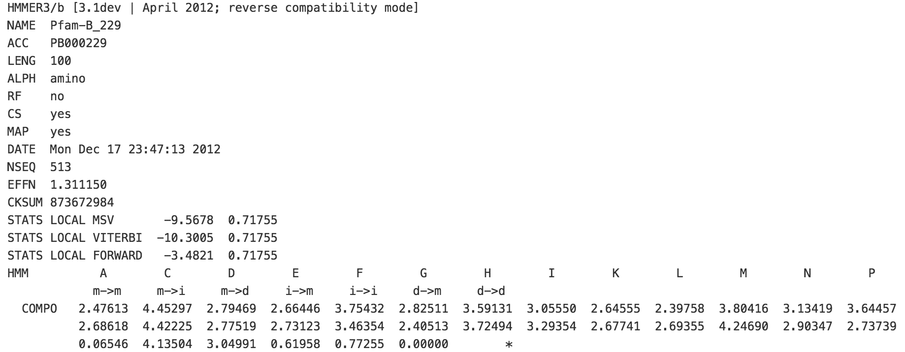

# CUDAMPF
###Latest release
v1.0.1 (Date: Feb 12th, 2016)
###Requirements
1. **Operating system(s)**: Linux
2. **Programming language(s)**: CUDA C/C++, PTX assembly
3. **Other requirement(s)**: CUDA 7.0 or later, GCC/G++ 4.4.7 or later, CUDA-
enabled GPUs with Compute Capability of 3.5 or higher
4. **License**: GNU GPL v3.0

###Run code
```
CUDAMPF [filterOpt] [modelOpt] [databaseOpt]
```
There are three filter options:
- "**-ssv**": Single Segment Viterbi filter (since HMMER3.1)
- "**-msv**": Multiple Segment Viterbi filter (since HMMER3.0)
- "**-vit**": Full P7Viterbi filter (since HMMER3.0)

Sequence database file must be **FASTA** format. An available protein sequence database is here: [ftp://ftp.ebi.ac.uk/pub/databases/Pfam/releases/Pfam27.0/](ftp://ftp.ebi.ac.uk/pub/databases/Pfam/releases/Pfam27.0/)

Model files must be **Profile HMM** format (usually with ".hmm" extension), which looks like:



In folder [query models](https://github.com/Super-Hippo/CUDAMPF/tree/master/quey%20models), there are 24 HMM models with different length provided.

###Notes
1. Please make sure paths of library and compiler correct and detectable when using **Makefile** to compile whole project: ```make all```.(i.e, CUDA_PATH, LIBRARIES, INCLUDES, HOST_COMPILER and NVCC)
2. Keep all kernel files (i.e, LMEM_MSV.cuh) in the same project folder. Otherwise, it will raise an error ```unable to open LMEM_MSV.cuh for reading!```
3. Current release ```v1.0.1``` only contains the code for one-batch benchmarking. Streaming benchmarking will be released in subsequent version.
4. Data preprocessing on host side are not optimized (i.e, sequence/model format), which are only plain implementations to guarantee all inputs correct. 
5. ```kernel time: xxxx(ms)``` indicates the consuming time on device.
6. Final results show the number of sequence pass through filters, which is 100% same as ```hmmsearch``` . Anyone wants to check out P-value for each sequence may modify ```RTC_XXX.cpp``` and print out variable ```p_value```.

###Contact
Any questions about the project please send email to: hjiang5 AT stevens DOT edu

##Licence
Please check the GNU License for CUDAMPF.
